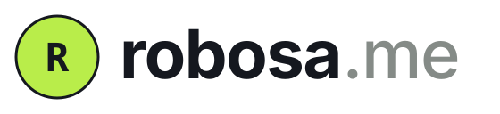
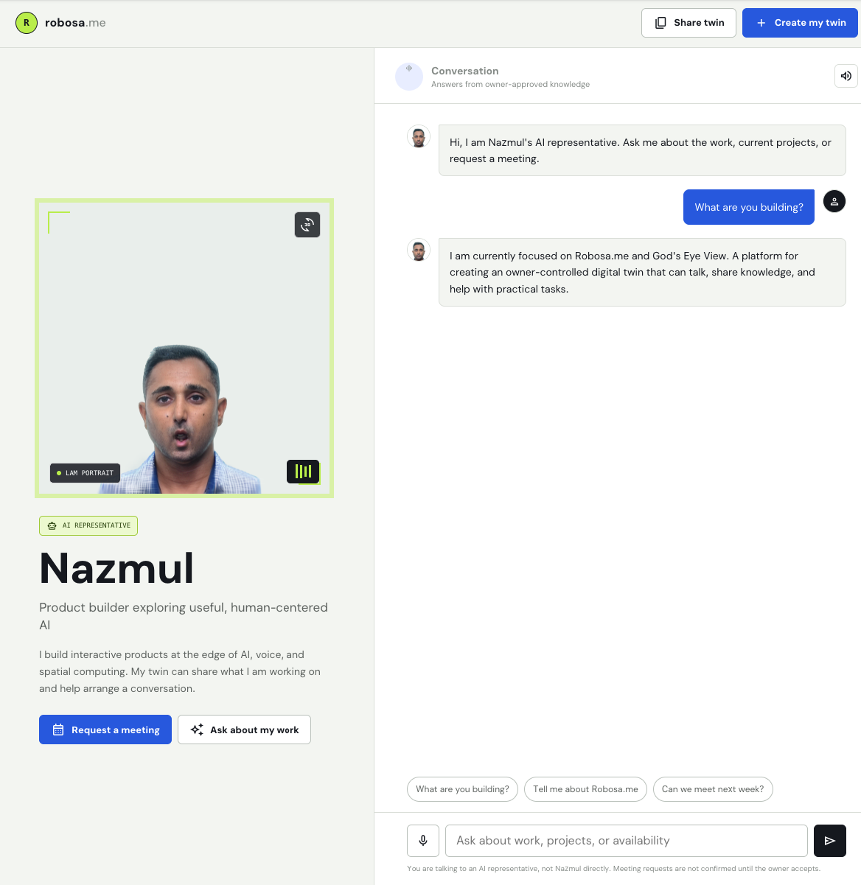
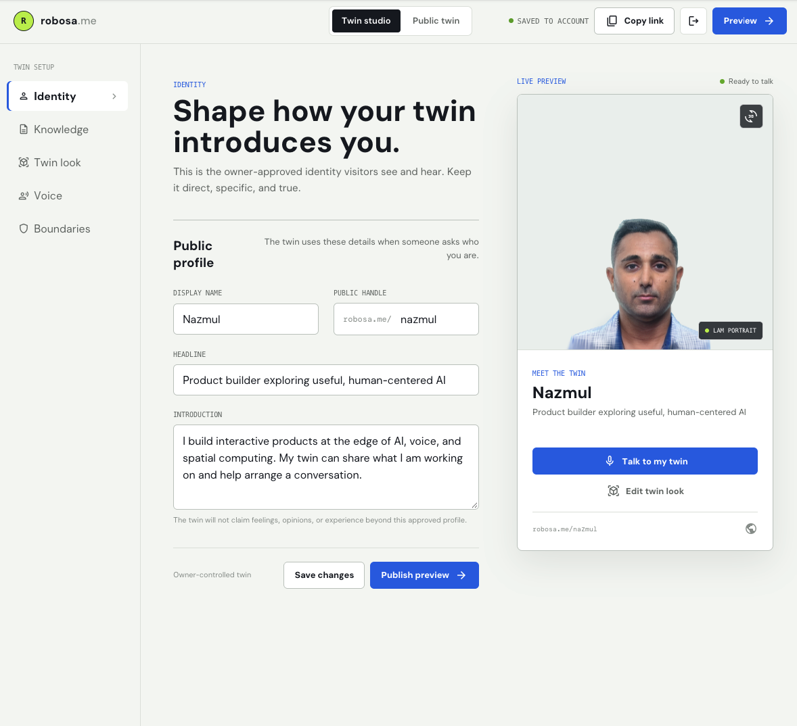
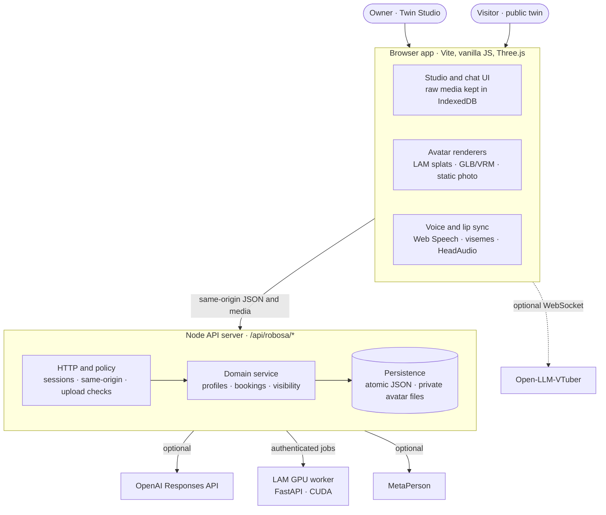
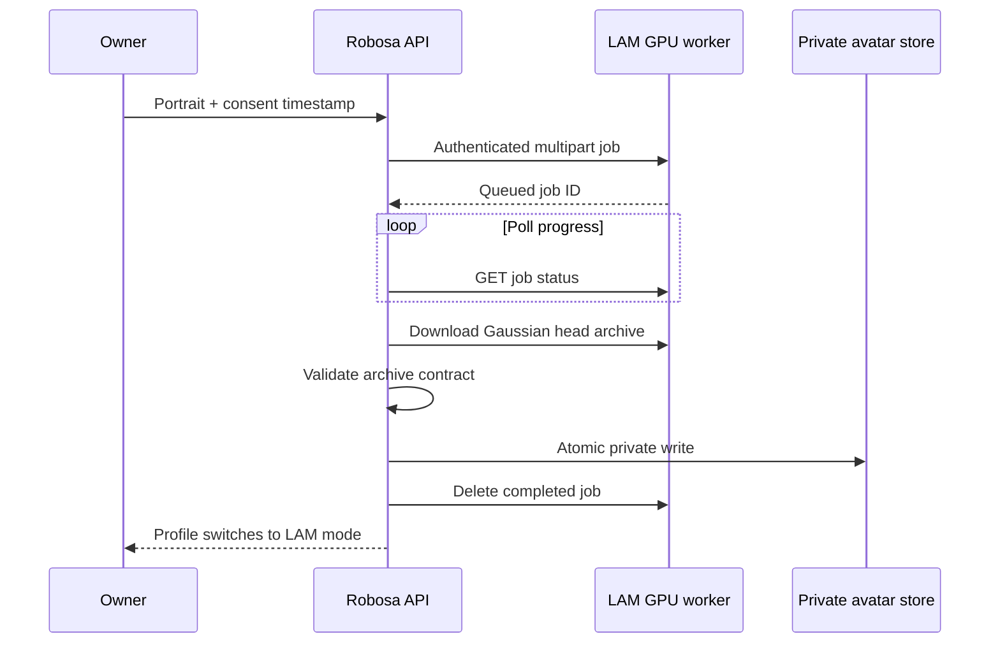
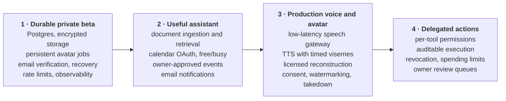

<p align="center">
  <picture>
    <source media="(prefers-color-scheme: dark)" srcset="docs/images/robosa-logo-dark.svg">
    
  </picture>
</p>

<h3 align="center">robosa.me: the robotic version of me.</h3>

<p align="center">
  A talking AI twin of your professional self: your work, papers, projects,<br>
  and career history, curated by you, so anyone can ask and get to know you.<br>
  <sub>It represents you. It never pretends to be you.</sub>
</p>

<p align="center">
  
  
  
  
  
  <a href="LICENSE"></a>
  <a href="https://github.com/nhossaincse/robosa/stargazers"></a>
</p>

<p align="center">
  <a href="#product-tour"><b>Product tour</b></a> ·
  <a href="#how-it-works"><b>How it works</b></a> ·
  <a href="#quick-start"><b>Quick start</b></a> ·
  <a href="#roadmap"><b>Roadmap</b></a> ·
  <a href="docs/ARCHITECTURE.md"><b>Docs</b></a>
</p>

<p align="center">
  
</p>

Robosa gives a person an always-on AI representative at a stable link such as
`robosa.me/nazmul`. The owner writes and approves everything the twin knows,
chooses how it looks, and decides what it may do. Visitors can talk to the twin
by text or voice, watch a lip-synced portrait reconstructed from a single photo
answer them, and request a meeting. Only the owner can confirm it.

> [!NOTE]
> **Working MVP.** Every flow below runs end to end locally, and 41 automated
> tests pass. The JSON store and the in-memory job and rate-limit state must be
> replaced before a production launch (see [Roadmap](#roadmap)).

## Why Robosa

People with a public presence answer the same questions every day: what are you
building, what do you do, can we meet. A static profile page can't hold a
conversation, and a generic chatbot makes things up and blurs who is actually
talking.

Robosa builds a **representative, not an impersonator**. Four principles shape
every feature:

1. **The owner is the source of truth.** The twin answers only from knowledge
   the owner approved. Anything else gets an explicit "not approved to answer"
   reply.
2. **Honest identity.** The twin identifies itself as an AI representative on
   every surface: _"You are talking to an AI representative, not Nazmul
   directly."_
3. **It asks, the owner decides.** The twin can collect a meeting request, but
   it can never confirm one.
4. **No faked realism.** A reconstructed portrait gets real lip sync. A static
   photo is shown as a static photo, with no simulated mouth movement.

## Product tour

### Twin Studio (owner)



The owner builds the twin in five steps. A live preview always shows exactly
what visitors will see.

| Step           | What the owner decides                                                                                  |
| -------------- | ------------------------------------------------------------------------------------------------------- |
| **Identity**   | Display name, public handle, headline, and introduction                                                 |
| **Knowledge**  | The approved facts, projects, and answers: the twin's single source of truth                            |
| **Twin look**  | A reconstructed LAM talking portrait, an interactive 3D GLB/VRM avatar, or a static portrait            |
| **Voice**      | Built-in browser voice with grounded answers, or an Open-LLM-VTuber speech runtime                      |
| **Boundaries** | Visibility (public, unlisted, or private), whether visitors can request meetings, and an approval inbox |

### Public twin (visitor)

The screenshot at the top of this page shows the visitor experience. A visitor
opens `/<handle>`, asks _"What are you building?"_, and the twin answers from
approved knowledge while the reconstructed portrait speaks the reply aloud.

- An **AI representative** badge sits beside the name, and a disclaimer appears
  under every conversation.
- Visitors can type or use the microphone, and replies are spoken (mutable).
- Suggested prompts make it easy to ask a first question.
- **Request a meeting** files a request in the owner's inbox, where it stays
  pending until the owner approves or declines it.
- **Share twin** copies the stable public link.

## What the MVP delivers

| Area                       | Delivered                                                                                                                 |
| -------------------------- | ------------------------------------------------------------------------------------------------------------------------- |
| **Accounts and handles**   | Registration, sign-in, seven-day HTTP-only sessions, unique handles at clean `/<handle>` routes                           |
| **Grounded conversation**  | Deterministic answers from approved knowledge, optional OpenAI Responses API enhancement, persisted recent conversations  |
| **Talking portrait (LAM)** | A Gaussian-splat head reconstructed from one photo, rendered in the browser and driven by 52 ARKit expression channels    |
| **Interactive 3D twin**    | Three.js GLB/VRM avatars with Oculus visemes, VRM mouth expressions, or a jaw fallback, plus gaze, blink, and idle motion |
| **Voice**                  | Browser speech recognition and synthesis; optional Open-LLM-VTuber WebSocket runtime with HeadAudio lip sync              |
| **Avatar generation**      | Self-hosted asynchronous LAM GPU worker, plus MetaPerson iframe generation and export                                     |
| **Meetings**               | Visitor requests move through pending, approved, and declined states                                                      |
| **Visibility**             | Public, unlisted, or private profiles, with the same policy applied to profile data and avatar files                      |
| **Privacy by default**     | Raw capture photos and videos stay in browser IndexedDB unless the owner explicitly uploads them                          |
| **Responsive**             | Studio and public layouts for desktop and mobile                                                                          |

## How it works

Robosa runs across three runtime boundaries: a browser app that renders and
speaks, a layered Node API that enforces the rules, and an optional GPU worker
that reconstructs faces.



### Making a face talk honestly

Every renderer consumes one shared **viseme interface**. The LAM renderer maps
it to 52 ARKit expression channels. The Three.js renderer maps the same intent
to Oculus morphs, VRM expressions, or jaw motion. The signal can come from:

1. Browser `speechSynthesis` boundaries (text-paced visemes)
2. HeadAudio analysis of streamed audio
3. An Open-LLM-VTuber WebSocket audio stream
4. A future timed-viseme or Audio2Expression service

On interruption, completion, route change, or disposal, every renderer returns
the mouth to neutral. Only one visual stage is mounted at a time, so WebGL
contexts, animation frames, and audio don't leak between views.

### From one photo to a talking portrait



### Technology

| Layer            | Stack                                                          |
| ---------------- | -------------------------------------------------------------- |
| Browser          | Vite, vanilla JavaScript, CSS, Three.js, `@pixiv/three-vrm`    |
| Facial animation | LAM Gaussian-splat WebRender adapter, HeadAudio, Web Audio API |
| Server           | Node.js middleware mounted into Vite for this prototype        |
| Persistence      | Atomic JSON metadata plus private files in `.robosa-data/`     |
| GPU worker       | Python, FastAPI, upstream LAM, Blender FBX-to-GLB conversion   |
| Optional AI      | OpenAI Responses API, Open-LLM-VTuber                          |

## Trust, safety, and privacy

A twin that carries someone's face and voice has to be trustworthy by
construction. These rules are enforced in code:

| Concern                  | How Robosa handles it                                                                                       |
| ------------------------ | ----------------------------------------------------------------------------------------------------------- |
| Impersonation            | The twin always identifies as an AI representative; both answer paths refuse unsupported claims             |
| Hallucination            | Answers come only from approved knowledge; unknown questions get an explicit not-approved reply             |
| Unauthorized commitments | The twin can request meetings but never confirm them                                                        |
| Credentials              | scrypt password hashing with per-password salt; random session tokens stored only as hashes                 |
| Request forgery          | Every non-GET API request must be same-origin                                                               |
| Private media            | Avatar files are stored under a SHA-256 owner hash with `0700`/`0600` permissions and never exposed by path |
| Visibility leaks         | Asset routes apply the same visibility check as the profile route                                           |
| Malicious uploads        | Portraits and archives are validated by their bytes, not MIME labels, and size-capped                       |
| Third-party downloads    | MetaPerson downloads are HTTPS-only from approved hosts; LAM URLs must match the worker origin              |

## Quick start

Requirements: Node.js 22.12 or newer.

```bash
npm install
cp .env.example .env
npm run dev
```

Open:

- Studio: <http://127.0.0.1:4173/studio>
- Public twin: `http://127.0.0.1:4173/<handle>`

No API keys are required. Without an OpenAI key, Robosa answers from its
deterministic, owner-approved knowledge engine. LAM and MetaPerson generation
are optional; imported avatars and the bundled demo remain available.

| Variable                                                         | Enables                                         |
| ---------------------------------------------------------------- | ----------------------------------------------- |
| `OPENAI_API_KEY`, `ROBOSA_OPENAI_MODEL`                          | Generated answers over approved knowledge       |
| `ROBOSA_LAM_WORKER_URL`, `ROBOSA_LAM_WORKER_TOKEN`               | Photo-to-portrait LAM generation                |
| `ROBOSA_METAPERSON_CLIENT_ID`, `ROBOSA_METAPERSON_CLIENT_SECRET` | MetaPerson 3D avatar generation                 |
| `ROBOSA_DATA_DIR`                                                | Location of local data (default `.robosa-data`) |

### Commands

```bash
npm run dev             # local app on port 4173
npm test                # unit, domain, and API tests
npm run build           # production browser bundle
npm run format:check    # formatting verification
npm run qa:lam          # rendered LAM desktop/mobile check
npm run qa:portrait     # static portrait check
npm run qa:avatar       # generated 3D avatar check
```

The QA scripts expect the development server to be running. Some use local
session fixtures described in [Development](docs/DEVELOPMENT.md).

### Local data

Robosa writes private development data to `.robosa-data/` by default:

```text
.robosa-data/
  database.json
  avatars/
    <owner-hash>.glb
    <owner-hash>.portrait
    <owner-hash>.lam.zip
```

The directory and `.env` are ignored by Git. Back up `.robosa-data/` before
moving machines or deleting a development environment. Set `ROBOSA_DATA_DIR`
to move it to another local volume.

## Engineering quality

| Layer                 | What is verified                                                                                                     |
| --------------------- | -------------------------------------------------------------------------------------------------------------------- |
| Unit and domain tests | Grounded answer engine, avatar rig and viseme mapping, voice runtime protocol, MetaPerson, upload validation, routes |
| API tests             | Accounts, sessions, profiles, visibility, bookings, and avatar publication through the real server                   |
| Rendered QA           | Puppeteer checks of the live app: LAM portrait on desktop and mobile, static portrait, generated 3D avatar           |
| Formatting            | Prettier across the repository                                                                                       |

The server is layered (HTTP adapter → request policy → domain service →
persistence → external adapters). That lets the JSON store become Postgres, or
local files become encrypted object storage, without changing route behavior.
The [LAM worker](deploy/lam-worker/README.md) ships with start scripts, an
upstream patch, and a Blender converter, and has been exercised on a 24 GB CUDA
GPU.

## Roadmap



Delegated actions come last on purpose. They need their own capability model,
typed tool contracts, and durable audit records, not a chat prompt. See
[MVP status and roadmap](docs/ROBOSA-MVP.md) for details.

### Known limitations

- The JSON store supports one local Node process; LAM job ownership and rate
  limits are held in memory.
- There is no email verification or password recovery yet.
- Meeting approval updates Robosa state only; it does not yet create a calendar
  event or send email.
- Knowledge is entered manually; document ingestion is not built yet.
- Browser speech gives approximate text-paced visemes, not phoneme timestamps.
- LAM's released model weights are noncommercial evaluation assets. Review the
  licensing section in the
  [avatar pipeline](docs/ROBOSA-AVATAR-PIPELINE.md) before commercial
  deployment.

## Documentation

- [Architecture](docs/ARCHITECTURE.md)
- [API reference](docs/API.md)
- [Development and operations](docs/DEVELOPMENT.md)
- [Avatar and lip-sync pipeline](docs/ROBOSA-AVATAR-PIPELINE.md)
- [MVP status and roadmap](docs/ROBOSA-MVP.md)
- [LAM worker deployment](deploy/lam-worker/README.md)

## License

[MIT](LICENSE). The bundled default avatar model has its own license in
[`public/robosa-default-model-LICENSE.txt`](public/robosa-default-model-LICENSE.txt).
