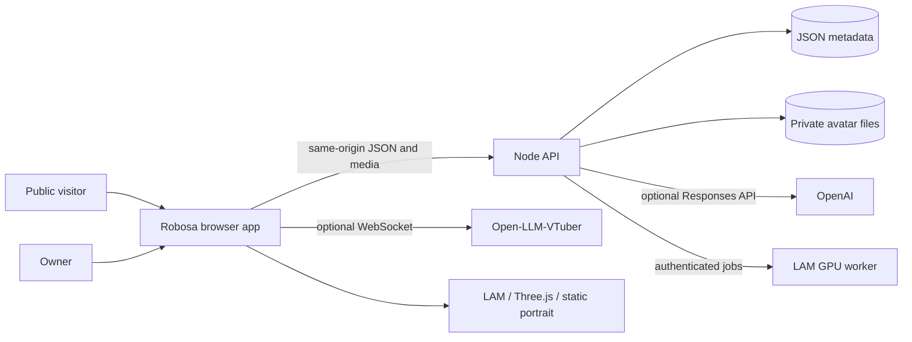

# Architecture

## System overview

Robosa has three runtime boundaries: the browser application, the Node
application server, and an optional GPU reconstruction worker.



`vite.config.js` mounts the API and clean-route middleware in development and
preview. Vite builds `robosa.html` as the browser entry. A production deployment
can retain the same HTTP contract while moving the API to a durable Node
service.

## Entry points

- `/` and `/studio` render the authenticated owner studio.
- `/<handle>` renders the public twin profile and conversation surface.
- `/api/robosa/*` is the application API.
- `robosa.html` loads `src/robosa/main.js`.

`server/providers/robosa/routes.js` rewrites clean browser routes to the HTML
entry. It does not rewrite assets, source modules, or API requests.

## Browser application

`src/robosa/main.js` is the composition root. It owns route hydration, the
current UI state, templates, event binding, API calls, and renderer lifecycle.
The file is intentionally the next frontend extraction boundary: new product
features should move cohesive panels or controllers into modules instead of
adding another unrelated section to it.

Supporting modules have narrower ownership:

| Module                 | Responsibility                                                     |
| ---------------------- | ------------------------------------------------------------------ |
| `profileStore.js`      | Profile normalization and browser draft persistence                |
| `mediaStore.js`        | Device-local source photos/videos in IndexedDB                     |
| `avatarStore.js`       | Device-local imported avatar selection and consent state           |
| `twinBrain.js`         | Deterministic, owner-approved fallback answers                     |
| `browserVoice.js`      | Web Speech recognition, synthesis, and text-paced visemes          |
| `voiceRuntime.js`      | Open-LLM-VTuber WebSocket protocol and audio queue                 |
| `audioLipSync.js`      | HeadAudio analysis for streamed audio                              |
| `avatarRig.js`         | Morph-target discovery and viseme mappings                         |
| `twin3d.js`            | Three.js, GLB/VRM loading, camera, idle motion, and facial driving |
| `lamTwin.js`           | LAM archive loading and viseme-to-ARKit expression driving         |
| `portraitTwin.js`      | Static portrait lifecycle                                          |
| `metaPersonCreator.js` | MetaPerson iframe authentication and export messages               |

Only one visual stage is mounted at a time. `main.js` disposes the current
stage before route or appearance changes so WebGL contexts, animation frames,
object URLs, and audio state do not leak across renders.

## Application server

The server follows a small layered design:

```text
HTTP route adapter (api.js)
  -> request/response policy (http.js, uploads.js, auth.js)
  -> domain service (service.js)
  -> persistence adapters (store.js, avatarFiles.js)
  -> external adapters (chat.js, metaperson.js, lamWorker.js)
```

### HTTP layer

`api.js` matches routes, requires sessions where appropriate, applies request
limits, and translates known errors into a stable JSON envelope. It does not
write database records directly.

`http.js` owns JSON parsing, same-origin checks, client address extraction, and
the prototype in-memory limiter. `uploads.js` owns byte caps, image signature
checks, and the LAM archive contract.

### Domain layer

`service.js` owns account, profile, booking, conversation, visibility, and
avatar-publication rules. It returns public representations that omit owner IDs,
password hashes, provider codes, and private file paths.

### Persistence

`store.js` serializes mutations through one promise queue and persists metadata
with write-then-rename replacement. `avatarFiles.js` stores binary files under
a SHA-256 hash of the owner ID, with directory mode `0700` and file mode `0600`.

The current database document contains:

- `users`: email, scrypt password hash, timestamps
- `profiles`: approved knowledge, publication settings, avatar metadata
- `sessions`: hashed session token and expiry
- `bookings`: visitor request and owner decision
- `conversations`: recent public chat turns

This adapter is appropriate for one local process. It does not provide
multi-instance locking, migrations, backups, indexes, or production auditing.

## Core flows

### Owner session

1. The owner registers or signs in.
2. The server sets a seven-day, HTTP-only, `SameSite=Lax` cookie.
3. The browser loads `/session`, then the profile and booking state.
4. Profile edits are normalized in the browser and again on the server.
5. Private binary assets are referenced by metadata, never by file-system path.

### Public conversation

1. The browser loads `/profiles/<handle>`.
2. Visibility policy is checked before profile or avatar metadata is returned.
3. A chat request creates or resumes a profile-scoped conversation.
4. `chat.js` uses the owner-approved profile with the OpenAI Responses API when
   configured; otherwise `twinBrain.js` supplies a deterministic answer.
5. Both paths refuse unsupported personal claims and never confirm meetings.

### Avatar publication

- LAM mode serves a validated private ZIP and drives 52 ARKit channels.
- 3D mode serves a private GLB/VRM and selects Oculus, VRM, or jaw controls.
- Portrait mode serves the original approved image without fake deformation.

Public asset routes apply the same visibility check as the profile route.
Private profiles remain accessible to their signed-in owner.

### Voice and lip sync

The visual stage consumes a common viseme interface. Signals can come from
browser speech boundaries, HeadAudio analysis, an Open-LLM-VTuber audio stream,
or a future timed-viseme service. Renderers translate the signal to their own
rig contract; static portraits ignore it.

## Security invariants

- Non-GET API requests must be same-origin.
- Session tokens are random, stored only as hashes, and sent in HTTP-only
  cookies.
- Passwords use Node's scrypt implementation with a per-password salt.
- Profile responses omit secrets and private storage coordinates.
- MetaPerson downloads are HTTPS-only and restricted to approved hosts.
- LAM artifact URLs must resolve to the configured worker origin.
- Portraits and archives are checked by bytes, not only browser MIME labels.
- Raw model archives are size-capped before persistence.

These are prototype defenses, not a complete production security program. See
[Development](DEVELOPMENT.md#production-checklist) for required deployment work.

## Extension boundaries

- Replace `store.js` with Postgres without changing route behavior.
- Replace `avatarFiles.js` with encrypted object storage and signed delivery.
- Add avatar generators behind `lamWorker.js` or a sibling provider adapter.
- Add calendar and email providers behind new domain methods, not in UI code.
- Extract studio panels and the public conversation controller from `main.js`
  as those areas gain independent state or tests.
