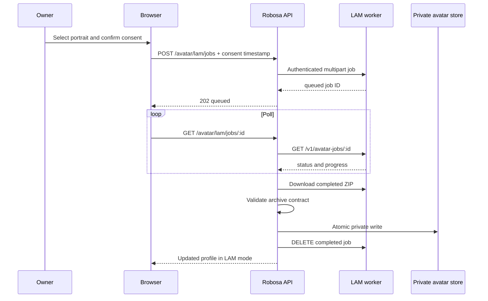

# Avatar and Lip-Sync Pipeline

Robosa separates source capture, avatar generation, private storage, browser
playback, and speech animation. A source portrait is not itself a 3D model, and
the browser never claims that scaling a mouth crop is lip sync.

## Published appearance modes

### LAM portrait

The server stores a validated LAM export ZIP. The browser loads the official
Gaussian renderer adapter and drives its 52 ARKit expression channels. Robosa
adds natural blink timing and maps current voice signals to ARKit mouth shapes.

Required archive members under one avatar directory:

```text
skin.glb
animation.glb
offset.ply
vertex_order.json
```

The upload cap is 120 MB.

### Interactive 3D

The browser loads a GLB or VRM through Three.js. Rig inspection selects the
best available control path:

1. Oculus-style visemes such as `viseme_PP` through `viseme_U`
2. VRM expressions `aa`, `ih`, `ou`, `ee`, and `oh`
3. ARKit or generic jaw-open fallback
4. Render-only mode when no compatible facial control exists

The generated-model cap is 30 MB. Models should embed textures or use
same-origin assets, face forward in a stable rest pose, and include left/right
blink controls.

### Static portrait

The server stores an approved JPEG, PNG, or WebP up to 10 MB. The browser shows
the full image without a synthetic mouth layer. Speech can still play, but the
image remains static.

## Source capture

Recommended LAM input:

- one neutral, evenly lit, front-facing portrait
- no cropped forehead, chin, or ears
- minimal occlusion and a plain background
- explicit subject authorization recorded before generation

Robosa can also retain an optional expression video in browser IndexedDB for a
future reconstruction provider. A useful capture is 8-15 seconds and contains a
slow head turn, two blinks, a smile, and `A E I O U`. The current LAM worker uses
the portrait only; it does not upload the expression video.

## Generation flow



Active job ownership is currently a Node in-memory map. A process restart loses
the mapping. Production must persist owner ID, worker job ID, state, timestamps,
consent reference, retries, and imported artifact hash.

## Worker contract

The Robosa server uses `ROBOSA_LAM_WORKER_URL` and a bearer token from either
`ROBOSA_LAM_WORKER_TOKEN` or `ROBOSA_LAM_WORKER_TOKEN_FILE`.

### Health

```http
GET /health
```

Health is intentionally unauthenticated and returns generator identity and
queue depth. It must not return tokens, source paths, or user data.

### Create job

```http
POST /v1/avatar-jobs
Authorization: Bearer <token>
Content-Type: multipart/form-data

portrait=<JPEG, PNG, or WebP>
consentReceipt={"subjectAuthorized":true,"recordedAt":"..."}
output=lam
rig=arkit-52
```

```json
{
  "id": "avjob_aabbcc",
  "status": "queued",
  "progress": 0,
  "generator": "lam-20k"
}
```

### Poll job

```http
GET /v1/avatar-jobs/avjob_aabbcc
Authorization: Bearer <token>
```

Expected states are `queued`, `running`, `complete`, and `failed`. A complete
response adds a same-origin `artifactUrl`.

### Read and delete artifact

```http
GET /v1/avatar-jobs/avjob_aabbcc/artifact
DELETE /v1/avatar-jobs/avjob_aabbcc
Authorization: Bearer <token>
```

Robosa rejects artifact URLs on a different origin, caps downloads at 120 MB,
validates the ZIP again, and deletes the completed worker job after import. The
worker refuses deletion while a job is queued or running.

Deployment scripts and the concrete FastAPI implementation are in
`deploy/lam-worker/`. See its README for the RunPod filesystem layout and
startup command.

## MetaPerson path

MetaPerson is the implemented interactive-3D provider adapter:

1. The server exchanges configured client credentials for a short-lived token.
2. The browser authenticates the embedded MetaPerson Creator iframe.
3. The owner generates and exports an avatar with facial controls.
4. The browser gives the export URL and provider code to the Robosa server.
5. The server accepts only approved HTTPS hosts, downloads at most 30 MB,
   validates a GLB v2 header, and writes the model privately.

Provider client secrets never enter browser code. Additional export CDN hosts
must be explicitly listed in `ROBOSA_METAPERSON_DOWNLOAD_HOSTS`.

## Lip-sync signal paths

Robosa uses one renderer-facing viseme interface with several possible signal
sources, ordered by expected quality:

1. Provider audio plus exact timed visemes or 52 ARKit coefficients
2. LAM Audio2Expression coefficients from a GPU speech service
3. HeadAudio analysis of streamed Open-LLM-VTuber audio
4. Text and speech-boundary estimation during browser `speechSynthesis`

The LAM renderer maps visemes to ARKit channels. The Three.js renderer maps the
same intent to Oculus morphs, VRM expressions, or jaw motion. On interruption,
completion, route change, or disposal, every renderer returns speech controls
to zero.

The current self-hosted worker performs reconstruction only. It does not run a
continuous Audio2Expression service. Robosa's LAM conversation animation is
therefore driven by current browser voice signals, not neural audio-derived
coefficients.

## Storage and publication

Generated files are outside the public directory:

```text
<ROBOSA_DATA_DIR>/avatars/<sha256(owner-id)>.glb
<ROBOSA_DATA_DIR>/avatars/<sha256(owner-id)>.portrait
<ROBOSA_DATA_DIR>/avatars/<sha256(owner-id)>.lam.zip
```

The profile stores only status, content type/provider, byte size, hash, rig
profile, and update time. Public URLs route through the service visibility
policy. There are no direct filesystem URLs.

For production, move these files to encrypted object storage. Keep the same
service contract and return short-lived or authenticated delivery URLs.

## Validation and security requirements

- Verify account ownership and subject authorization before generation.
- Validate content by bytes and decoder, not filename or MIME header alone.
- Limit image dimensions, duration, archive expansion, file count, and paths.
- Reject absolute paths and traversal entries during archive processing.
- Isolate model conversion and treat provider output as untrusted.
- Scan generated assets before publication.
- Record source hash, consent reference, generator/version, output hash, and
  publication decision in a private audit record.
- Label every public experience as an AI representative.
- Provide owner deletion, subject reporting, and takedown workflows.

The current ZIP check verifies required names but does not extract the archive
on the Node server. The browser renderer opens it. Add compressed/uncompressed
size and entry-count checks before accepting arbitrary public uploads.

## Licensing

LAM source code is Apache-2.0 and LAM WebRender is MIT. The released pretrained
LAM model weights are CC BY-NC 4.0. They are suitable for noncommercial
evaluation, not a commercial Robosa service. Commercial deployment needs
written permission or independently trained weights with compatible data and
model licensing.

Open-LLM-VTuber provides conversation and Live2D orchestration; it does not
reconstruct a person's 3D face. MetaPerson has its own service terms and plan
limits. Review provider, model, voice, training-data, and generated-output terms
before launch.

## Production target

The durable target is an asynchronous job system with:

- persisted jobs and idempotency keys
- signed source uploads and result downloads
- isolated GPU workers with no public control port
- retries, cancellation, timeouts, and dead-letter handling
- immutable consent and provenance records
- automatic raw-capture retention/deletion policy
- commercially compatible reconstruction and voice rights
